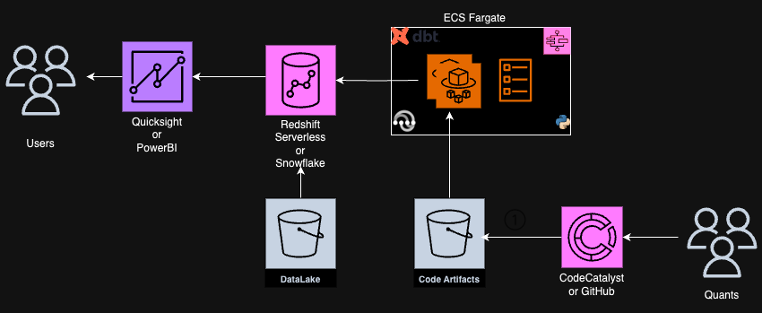

# Data and Analytics development on AWS

Any analytics development that involves a large amount of data needs the following components:
1. A data warehouse to store the data
2. A platform to compute analytics using either SQL or python on the data stored in the warehouse
3. A development environment to code in python or SQL. It should be easy to develop or deploy new analytics and debug any issue with the existing analytics.
4. An *orchestrator* that runs and coordinates the different parts of building the analytics such as 
    * data ingestion
    * python calculations 
    * SQL calculations   

## Framework

Here is one flexible framework for development on AWS. It uses the following services:
1. **AWS Step Functions + Fargate + Lambda** to orchestrate the different components of the buidling of analytics
2. A slim python container for Fargate that downloads the following from S3 after launching:
    * python code that needs to be run
    * python virtual environment with all the dependencies needed to run the python code
The container then runs the python code. The location of the code, venv in S3 and the command to run are passed as environment variables to the container. The container is registered in ECR and is used for CI/CD workflows as well.
3. An S3 bucket to host all the python modules developed in the process of developing the analytics.
4. A framework to organize SQL models such as dbt or SQLMesh
5. **CodeCatalyst** or **GitHub** to house all the python and dbt/SQL mesh code used to build analytics, serverless framework code ( or other IAC ) to define containers, lambda functions, ECS tasks, step functions, etc. It also has the necessary workflows to build python virtual environments, copy code or virtual environments to S3, define or update Fargate tasks, Lambdas, Step functions, Docker containers, etc., upon pushing the code to the main branch. 
6. Finally, we can use any IDE such as VSCode to develop the SQL or python models.
7. A data warehouse such as snowflake or redshift on AWS

## Architecture

